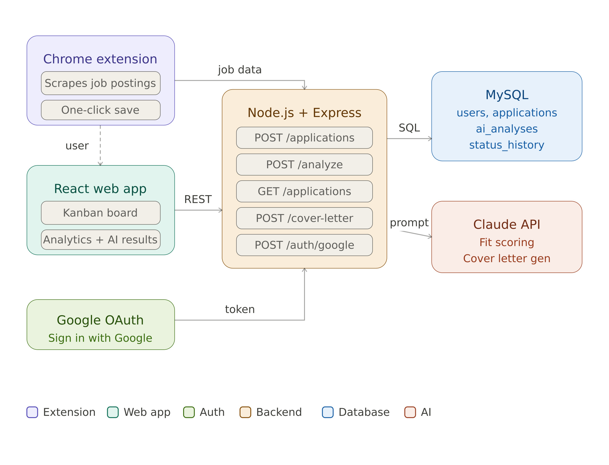

# Job Application Tracker

## Purpose
Keeping track of job applications can get messy, and it's hard to know if your resume is actually a good fit for a role before you apply. This project is a web app + Chrome extension that saves jobs as you browse, tracks applications through the hiring process, and uses AI to score your resume against a job description and help draft a cover letter.

---

## Goals
- Replace the "spreadsheet method" with a smarter, structured tracker
- Use AI to give real signal on resume fit before applying
- Make cover letter drafting faster with a personalized scaffold
- Surface insights across all applications (response rates, keyword trends)

---

## Tech Stack
- **Frontend:** React + Tailwind CSS
- **Backend:** Node.js + Express
- **Database:** MySQL
- **AI:** Anthropic API (Claude)
- **Extension:** Chrome Extension (Vanilla JS)

---

## ERD

- There still might be work to do on this design, but it captures what I need for the initial project

---

## System Design

- There is likely work to do here as well, but this captures the main functionality of the application.

