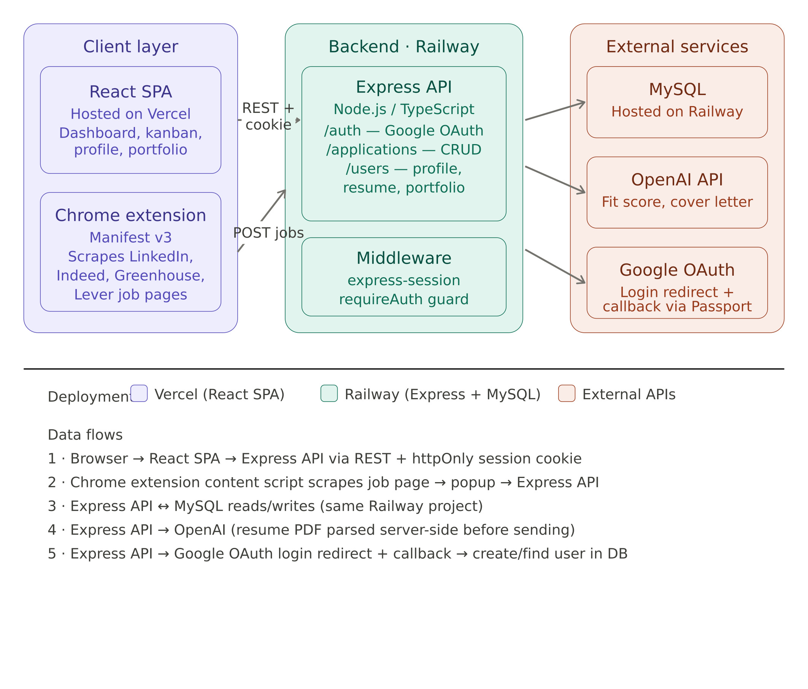
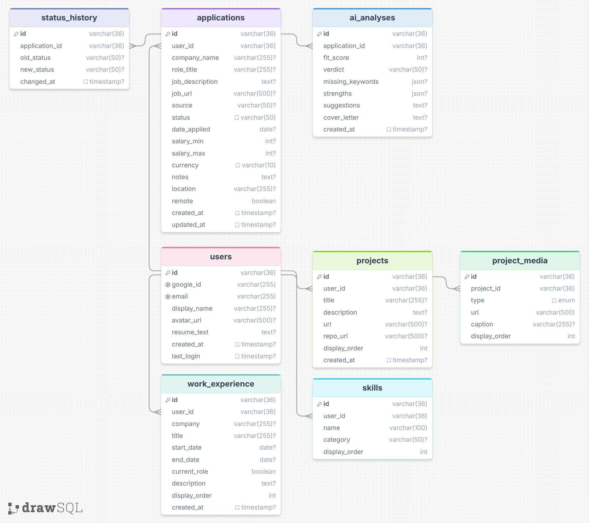

# Folio — Job Application Tracker
> Folio is a job application tracker that helps you keep track of your application pipeline. I also wanted it to offer useful insight regarding the fit of your resume vs the description of the job. It uses AI to analyze how well you are suited for the job and offers suggestions on changes you could make to your resume / cover letter before applying.

---

## Demo

[Download demo video](demo.mp4)

---

## Architecture Diagram

----
## ERD

---

## Tech Stack

| Layer | Tech |
|---|---|
| Frontend | React + TypeScript + Tailwind CSS |
| Backend | Node.js + Express |
| Database | MySQL |
| AI | OpenAI API |
| Extension | Chrome Extension (Vanilla JS) |
| Hosting | Vercel (frontend) + Railway (backend/DB) |

---

## Key Learnings

1. **Chrome Extensions**  _I've never built a Chrome Extension. Turns out it's really not too hard, but there were some considerations I had to think about. One of those was Auth, how can the extension know that the user is signed in to the webapp? I had to think about what sort of auth I wanted to use for the application._

2. **Prompt Engineering** _Prompt engineering for resume scoring was harder than expected. It seemed that small wording changes in the system prompt could produce wildly different scores. I also played around with different models producing more content or less content. I'm fairly happy with the balance I've struck so far, but imagine that future tweaking will be needed._

3. **Deployment** _I've never used Vercel or Railway, only AWS. It was refreshing to not have to dig through the AWS console or CLI, but there were some difficulties in getting the app up and running such as ENV variable mismatching, DB connections, and CORS issues. Overall though I love how simple these softwares make deploying your own software._

---

## AI Integration

**Does your project use AI? Yes.**

Folio uses OpenAI API for a few things:

- **Resume Parsing** — Users can upload their resume, and AI will parse the data from it to build out their personal profile. This info is fully editable by the user, but the goal was to make this process quicker.
- **Resume fit scoring** — The main feature of the application is letting a user compare their resume info against a job description. After a job description is saved, the user can run an analysis and get scores, suggestions, cover letter drafts, and more.

---

## How I Used AI to Build This

- Claude Code was a big part of development. It helped me shape the structure of the web app and determine crucial architecture desicions. It also helped me create and ship features that weren't originally a part of the scope.
- Claude also walked me through some vercel / railway hosting issues.

---

## Why This Project

> Searching for a job is stressful. When I applied to internships a couple years ago I filled a spreadsheet up with 100+ entries and felt like I didn't really have any insight into how well I was fit for the job. I wanted to build a tool that would make people a little more confident when applying for jobs to reduce the stress that comes from it. There's still a lot I would love for this tool to do, but the goal will always be to help people find jobs they love.

---

## Scaling, Performance & Auth

### Authentication
- Google OAuth via session cookies, managed server-side with Express.

### Failover & Hosting
- Frontend deployed to Vercel (CDN edge, zero-downtime deploys). Backend and MySQL on Railway. For the time being I don't see myself scaling it up to paid tiers, but if that were the case the platforms will take care of any discrepancies

### Performance
- PDF resume parsed server-side before being sent to OpenAI to minimize token usage
- If several people are waiting on AI analysis, the server could get bogged down with requests. Might need to implement some sort of queue to handle those long running requests.

### Scaling
- Since Railway and Vercel would handle most of this, the only thing to think about would be OpenAI rate limits if it got to enough users. In that case we would need to upgrade our usage tier with OpenAI